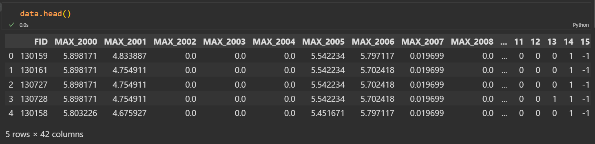

# 任务：用python代码计算数值的变化趋势
### 使用环境说明
#### 代码使用jupyter notebook编写（支持看到代码每一步的输入输出），读本代码之前建议学习python的pandas，matplotlib,熟悉基本用法。代码运行之前使用Anaconda Prompt终端下载 pandas 和 matplotlib。
    编译器：Anaconda-jupter Notebook
    环境——python版本：python3.7
    编译器下载网址：https://mirrors.tuna.tsinghua.edu.cn/anaconda/archive/
### 下载pandas和matplotlib

## 任务一
 提供了2000-2020共20年的数据，每年的数据均在excel中。首先获取excel中FID的值以及对应的MAX值，如当前FID值并没有出现在所有的20个excel文件中，直接过滤掉（如FID值为4时，存在着excel文件的内容中不包含FID为4的情况，该FID直接过滤）。
```python
import pandas as pd
data=pd.read_excel("./20年的栅格碳排放/20年的栅格碳排放/2000.xlsx")#读出第一年的数据

data.columns=["FID","COUNT","AREA","MAX"]#第一个文件中"FID"字段为“FID_”，将其改为统一的["FID","COUNT","AREA","MAX"]
data["Index"]=data["FID"]
data.set_index("Index",inplace=True)#将FID设置为Index（索引）
col=data["FID"]##定义最终需要的FID序列对象为col
for i in range(2001,2021):# for循环的含义就是 利用merge函数内连接（“inner”）——二十个excel文件的FID字段的交集
    data1=pd.read_excel("./20年的栅格碳排放/20年的栅格碳排放/{}.xlsx".format(i))
    data1=data1[["FID","COUNT","AREA","MAX"]]
    # data1.columns=["FID","COUNT","AREA","MAX"]
    data1["Index"]=data["FID"]
    # data1.drop_duplicates(subset=['FID'], keep='first', inplace=True)
    data1.set_index("Index",inplace=True)
    col1=data1["FID"]#只计算FID字段的交集，减少内存使用，增加代码效率
    # 列拼接的内连接（交）
    col=pd.merge(col, col1, how='inner')
lis=list(col["FID"])## 将最后的dataFrame序列转为list列表，便于下方使用
``` 


## 任务二
之后计算剩下的每个FID值在连续20年内对应的MAX值的变化趋势（包括递增、不变和递减。使用1，0和-1分别表示上述三种趋势）。
```python
#第一步
## 先做2000年的，提取出二十个文件中的“FID”和“MAX”字段（只包含col中含有的FID），并使用merge操作内连接（交集）
data=data[["FID","MAX"]][data["FID"].isin(lis)]#提取出来每个表中拥有col（FID）序列的文件内容。
data.columns=["FID","MAX_2000"]
list1=[]
#和任务一求所用方法相同
for i in range(2001,2021):
    data1=pd.read_excel("./20年的栅格碳排放/20年的栅格碳排放/{}.xlsx".format(i))
    data1=data1[["FID","MAX"]][data1["FID"].isin(lis)]
    data1.columns=["FID","MAX_{}".format(i)]
    data=pd.merge(data,data1,how='inner')

#第二步，通过前后列相比，先将所有的列赋值为0，增加赋值1，减少赋值为-1。
for i in range(1,21):
    data["{}".format(i)]=0
for i in range(1,21):
#     # if data["MAX_{}".format(i)]>data["MAX_{}".format(i)]:
    data["{}".format(i)][data["MAX_{}".format(i+2000)]>data["MAX_{}".format(i-1+2000)]]=1
    data["{}".format(i)][data["MAX_{}".format(i+2000)]<data["MAX_{}".format(i-1+2000)]]=-1
```
第一步执行完：

第二步执行完得到变化趋势表：

## 任务三 
需要输出的每个FID值在20年内对应的MAX值的变化趋势情况（如FID为100时，在2000-2005年处于递增，在2005-2010处于不变，在2010-2020处于递减，则输出的结果应为100，1(2000-2005)，0(2005-2010)，-1(2010-2020)）。
```python
## 将dataTrends中的数据凑成自己需要的数据类型，凑出来任务需要的数据格式。
dataTrends=data[['FID','1', '2', '3', '4', '5',
       '6', '7', '8', '9', '10', '11', '12', '13', '14', '15', '16', '17',
       '18', '19', '20']]
dataTrendsTwo=data[['1', '2', '3', '4', '5',
       '6', '7', '8', '9', '10', '11', '12', '13', '14', '15', '16', '17',
       '18', '19', '20']]
#显示所有列
pd.set_option('display.max_columns', None)
listSum=[]
for i in dataTrends["FID"]:##计算每一行
    list1 = dataTrendsTwo[dataTrends["FID"]==i].values.tolist()[0]##变化序列
    # list1=[-1, -1, 0, 0, 1, 1, -1, -1, 0, 0, 0, 0, 0, 1, -1, 1, -1, -1, 0, 0]
    list2=[]
    num=0
    for j in range(1,len(list1)):#遍历变化序列
        if(list1[j]!=list1[j-1] and list1[j-1]==-1):#趋势发生变化时
            str1="-1"+"({},{})".format(2000+num,2000+j)#凑数据格式
            # print("*****")
            num=j#记录每一种趋势的开始
            list2.append(str1)
            if(j==19):#最后一种趋势变化。
                str1="{}".format(list1[-1])+"({},{})".format(2000+num,2000+j+1)
                list2.append(str1)
        elif(list1[j]!=list1[j-1] and list1[j-1]==0):
            str1="0"+"({},{})".format(2000+num,2000+j)
            list2.append(str1)
            num=j
            if(j==19):
                str1="{}".format(list1[-1])+"({},{})".format(2000+num,2000+j+1)
                list2.append(str1)
        elif(list1[j]!=list1[j-1] and list1[j-1]==1):
            str1="1"+"({},{})".format(2000+num,2000+j)
            list2.append(str1)
            num=j
            if(j==19):
                str1="{}".format(list1[-1])+"({},{})".format(2000+num,2000+j+1)
                list2.append(str1)
        else:
            if(j==19):
                str1="{}".format(list1[-1])+"({},{})".format(2000+num,2000+j+1)
                list2.append(str1)
    listSum.append(list2)
dataEnd=pd.DataFrame(listSum)
dataEnd.head()#得到的趋势
```

## 任务四
需将每个FID值对应的变化情况输出到一个文件名为trend的excel文件之中。
```python
dataEnd["FID"]=col["FID"]#将FID列加入trend文件中
dataEnd.to_excel("./trend.xlsx")
```
## 额外任务
附加任务：生成文件名为trend的excel文件之后，撰写一个可以自动读取每一行数据的脚本，该脚本要能够根据该行数据自动绘制并输出折线图，折线图的横坐标为年份，纵坐标为趋势值。生成的折线图以该行的FID值命名，然后保存到trend文件夹之中。
```python
import matplotlib.pyplot as plt 
import pandas as pd
# 设置图像中文字标识，可以使用中文显示
plt.rcParams['font.family'] = 'SimHei'
plt.rcParams['axes.unicode_minus'] = False
#设置在文件中显示图像
%matplotlib notebook
## 首先读取trend
TrendData=pd.read_excel("./trend.xlsx")
TrendData.drop("Unnamed: 0",axis=1,inplace=True)
TrendData.set_index('FID', inplace=True)
import re#正则表达式
listSumTwo=[]
# 读取文件中的例如：1（2000，2006）格式内容，将其转化为[1,1,1,1,1,1]
for fid in list(TrendData.index):
    list3=[]
    for i in TrendData[TrendData.index==fid].values[0]:
        if(str(i)!="nan"):##利用正则表达式，凑出来趋势列表
            pattern = r"(-?\d+)"
            matches = re.findall(pattern, i)
            # print(matches)
            for j in range(int(matches[1]),int(matches[2])):
                list3.append(int(matches[0]))
    # print(list3)
    listSumTwo.append(list3)
dataSumTwo=pd.DataFrame(listSumTwo)
dataSumTwo["FID"]=TrendData.index

dataSumTwo.set_index("FID",inplace=True)
fid=input("用户自己选出一个FID画图")## 由于FID数量太多，选出一个画图，由用户自己输入
##折线图的横坐标为年份，纵坐标为趋势值。
def draw(fid):
    plt.figure(figsize=(20, 10), dpi=100)
    year=["2000-2001","2001-2002","2002-2003","2003-2004","2004-2005","2005-2006","2006-2007","2007-2008","2008-2009",
          "2009-2010","2010-2011","2011-2012","2012-2013","2013-2014","2014-2015","2015-2016","2016-2017","2017-2018",
          "2018-2019","2019-2020",]
    trend = list(dataSumTwo[dataSumTwo.index==130159].values[0])
    plt.plot(year, trend)
    plt.xlabel("日期")
    plt.ylabel("趋势|0:不增长；1:增长；-1:减少")
    plt.show()
draw(fid)
```
